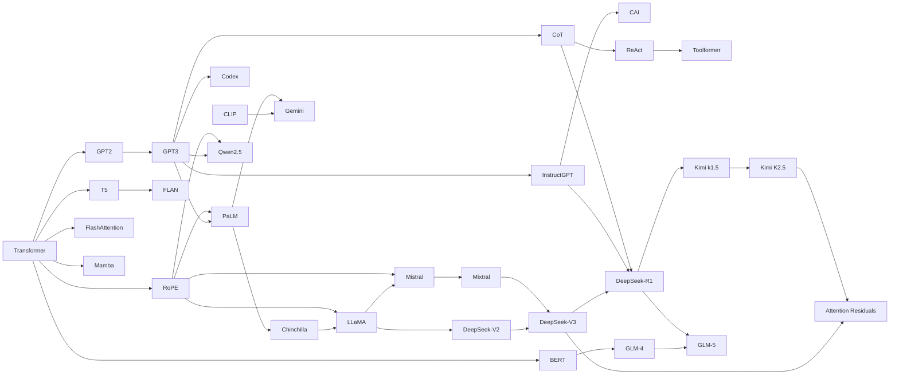

# Top 35 Research Papers in Large Language Models

This section provides **in-depth documentation** for the 35 landmark papers that shaped modern LLMs. Each paper page includes:

- **Simple math explanations** — every equation broken down step by step
- **Python implementations** — runnable code demonstrating the core ideas
- **Interview importance** — why interviewers ask about it and difficulty level
- **Interview Q&A** — specific questions with detailed answers
- **Connections** — how each paper relates to others

## How to Use This Section

1. **Quick review:** Read the TL;DR and Key Takeaways table at the bottom of each page
2. **Deep study:** Work through the math section and run the Python code
3. **Interview prep:** Focus on the Interview Q&A section — practice explaining these aloud
4. **Build connections:** Follow the "Connections to Other Papers" links to see how ideas evolved

## Papers by Category

### Architecture Foundations

| # | Paper | Year | Key Contribution |
|---|---|---|---|
| 1 | [Attention Is All You Need](01_attention_is_all_you_need.md) | 2017 | Transformer architecture — self-attention replaces recurrence |
| 2 | [BERT](02_bert.md) | 2018 | Bidirectional encoder with masked language modeling |
| 3 | [GPT-2](03_gpt2.md) | 2019 | Decoder-only LM with zero-shot task transfer |
| 5 | [T5](05_t5.md) | 2019 | Unified text-to-text framework with span corruption |
| 6 | [XLNet](06_xlnet.md) | 2019 | Permutation language modeling for bidirectional AR |
| 34 | [RoPE/RoFormer](34_rope_roformer.md) | 2021 | Rotary Position Embedding — relative position via rotation |

### Training Recipes & Scaling

| # | Paper | Year | Key Contribution |
|---|---|---|---|
| 4 | [GPT-3](04_gpt3.md) | 2020 | 175B params, in-context learning, scaling laws |
| 7 | [RoBERTa](07_roberta.md) | 2019 | Recipe matters — dynamic masking, no NSP, more data |
| 8 | [ELECTRA](08_electra.md) | 2020 | Replaced-token detection — 100% token utilization |
| 10 | [PaLM](10_palm.md) | 2022 | 540B dense model, Pathways infrastructure, emergence |
| 11 | [Chinchilla](11_chinchilla.md) | 2022 | Compute-optimal training — balance params and data |
| 12 | [LLaMA](12_llama.md) | 2023 | Open weights, RMSNorm + SwiGLU + RoPE standard |

### Alignment & Instruction Following

| # | Paper | Year | Key Contribution |
|---|---|---|---|
| 9 | [InstructGPT](09_instructgpt.md) | 2022 | RLHF pipeline — SFT → Reward Model → PPO |
| 17 | [FLAN](17_flan.md) | 2022 | Instruction tuning on 1,800+ tasks |
| 21 | [Constitutional AI](21_constitutional_ai.md) | 2022 | RLAIF — AI feedback guided by principles |

### Efficient Architecture & Serving

| # | Paper | Year | Key Contribution |
|---|---|---|---|
| 13 | [LoRA](13_lora.md) | 2021 | Low-rank adaptation — freeze base, train tiny updates |
| 14 | [FlashAttention](14_flash_attention.md) | 2022 | IO-aware exact attention — tiling in SRAM |
| 15 | [Mistral 7B](15_mistral.md) | 2023 | GQA + sliding window attention for efficient 7B |
| 16 | [Mixtral](16_mixtral.md) | 2024 | Sparse MoE — 8 experts, top-2 routing |
| 24 | [Mamba](24_mamba.md) | 2023 | Linear-time SSM with selective state spaces |
| 35 | [Attention Residuals](35_attention_residuals.md) | 2026 | Replace fixed residuals with attention over layers |

### Reasoning, Tools & Agents

| # | Paper | Year | Key Contribution |
|---|---|---|---|
| 18 | [Chain-of-Thought](18_chain_of_thought.md) | 2022 | Reasoning via intermediate steps in prompts |
| 19 | [ReAct](19_react.md) | 2023 | Thought → Action → Observation agent loop |
| 20 | [Toolformer](20_toolformer.md) | 2023 | Self-supervised API calling via loss comparison |

### Multimodal & Code

| # | Paper | Year | Key Contribution |
|---|---|---|---|
| 22 | [CLIP](22_clip.md) | 2021 | Contrastive image-text learning, zero-shot classification |
| 23 | [Codex](23_codex.md) | 2021 | Code generation, HumanEval benchmark, pass@k metric |
| 25 | [Gemini](25_gemini.md) | 2023 | Native multimodal — text, images, audio, video |

### Chinese Lab Contributions (2024–2026)

The Chinese research ecosystem produced several landmark papers in 2024–2026 that fundamentally changed how the field thinks about reasoning, KV cache efficiency, MoE training, agentic systems, and multi-agent coordination. These are essential reading for any LLM interview in 2025–2026.

| # | Paper | Lab | Year | Key Contribution |
|---|---|---|---|---|
| 26 | [DeepSeek-V2](26_deepseek_v2.md) | DeepSeek | 2024 | Multi-Head Latent Attention (MLA) — 93% KV cache reduction |
| 27 | [DeepSeek-V3](27_deepseek_v3.md) | DeepSeek | 2024 | 671B MoE, auxiliary-loss-free load balancing, FP8 training, MTP |
| 28 | [DeepSeek-R1](28_deepseek_r1.md) | DeepSeek | 2025 | RL-only reasoning (R1-Zero), GRPO, cold-start distillation |
| 29 | [ChatGLM / GLM-4](29_glm4.md) | Zhipu AI / THU | 2024 | GLM pretraining unifies MLM+CLM; bilingual at scale |
| 30 | [Kimi k1.5](30_kimi_k1_5.md) | Moonshot AI | 2025 | Long-context RL scaling; partial rollouts; online mirror descent |
| 31 | [Qwen2.5](31_qwen2_5.md) | Alibaba | 2024 | 18T tokens, 72B matches 405B Llama; Qwen2.5-Math/Coder family |
| 32 | [GLM-5](32_glm5.md) | Zhipu AI / THU | 2026 | 744B MoE, Slime async RL, SotA open-weight agentic coding |
| 33 | [Kimi K2.5](33_kimi_k2_5.md) | Moonshot AI | 2026 | 1T MoE, Agent Swarm (PARL), native multimodality with MoonViT |

---

## Paper Summaries — Context, Motivation, and Key Ideas

### Architecture Foundations

**[Attention Is All You Need](01_attention_is_all_you_need.md) (Vaswani et al., 2017)** — Before this paper, sequence models relied on recurrence (RNNs, LSTMs), which processed tokens sequentially and created a fundamental bottleneck: training could not be parallelized across time steps, and long-range dependencies faded through the chain. The Transformer replaced recurrence entirely with self-attention — every token attends to every other token in a single operation, enabling full parallelization on GPUs. Multi-head attention lets the model capture different relationship types (syntax, coreference, semantics) simultaneously. This architecture became the backbone of every modern LLM.

**[BERT](02_bert.md) (Devlin et al., 2018)** — GPT-1 showed that Transformers could be pre-trained, but its left-to-right autoregressive objective meant each token could only attend to previous tokens — missing context from the right. Google's BERT introduced masked language modeling (MLM): randomly mask 15% of tokens and predict them using bidirectional context. This enabled pre-training deep bidirectional representations, then fine-tuning on downstream tasks (classification, NER, QA) with minimal task-specific architecture. BERT demonstrated that pre-training + fine-tuning was the dominant paradigm, achieving state-of-the-art on 11 NLP benchmarks simultaneously.

**[GPT-2](03_gpt2.md) (Radford et al., 2019)** — OpenAI scaled the GPT architecture to 1.5B parameters and trained on 40GB of web text (WebText). The key finding was zero-shot task transfer: without any fine-tuning, GPT-2 could perform summarization, translation, and question answering by simply framing tasks as text completion. This challenged the prevailing "pre-train then fine-tune" paradigm and suggested that language models might be implicit multi-task learners. The controversial decision to initially withhold the full model due to misuse concerns also sparked the first AI safety debate around open-weight releases.

**[T5](05_t5.md) (Raffel et al., 2019)** — Google's Text-to-Text Transfer Transformer reframed every NLP task as text generation: classification becomes "sentiment positive" or "sentiment negative" as output text, translation becomes "translate English to German: [text]", etc. This unified framework enabled systematic comparison of pre-training objectives, model sizes, and data strategies. T5 introduced span corruption (masking contiguous spans rather than individual tokens) and demonstrated that the same architecture, objective, and fine-tuning procedure works for any text task — simplifying the ML pipeline from many task-specific models to one.

**[XLNet](06_xlnet.md) (Yang et al., 2019)** — XLNet identified a fundamental conflict: BERT's masked LM objective sees all context but introduces artificial [MASK] tokens that never appear in real text (pretrain-finetune discrepancy), while autoregressive models see no [MASK] but can only attend left-to-right. XLNet resolved this with permutation language modeling — train an autoregressive model on all possible orderings of the input, so it learns bidirectional context without masking. This required a novel two-stream attention mechanism. XLNet outperformed BERT on 18 benchmarks, though its complexity limited widespread adoption.

**[RoPE/RoFormer](34_rope_roformer.md) (Su et al., 2021)** — RoPE (Rotary Position Embedding) replaced additive positional encodings with multiplicative rotations of query and key vectors. By rotating Q and K in 2D subspaces using position-dependent angles, RoPE naturally encodes relative position in the dot product without any learned parameters. The geometric frequency progression (\(\theta_i = 10000^{-2i/d}\)) creates a natural locality bias and excellent length extrapolation. RoPE became the **industry standard** for positional encoding, adopted by LLaMA, Mistral, Qwen, PaLM, and virtually every modern open-weight LLM. Extensions like NTK-aware scaling and YaRN enable 4-32× length extrapolation beyond training context.

### Training Recipes & Scaling

**[GPT-3](04_gpt3.md) (Brown et al., 2020)** — OpenAI scaled to 175B parameters and discovered that sufficiently large language models can perform tasks through in-context learning: provide a few input-output examples in the prompt, and the model generalizes to new inputs without any gradient updates. This was a paradigm shift — no fine-tuning, no task-specific heads, just prompt engineering. GPT-3 also established the scaling laws suggesting that performance improves predictably with model size, data, and compute, motivating the race to ever-larger models.

**[RoBERTa](07_roberta.md) (Liu et al., 2019)** — Facebook showed that BERT was significantly undertrained. By removing the Next Sentence Prediction objective (which hurt performance), using dynamic masking (different masks each epoch instead of static), training on 10× more data with larger batches, and training for longer, RoBERTa matched or exceeded XLNet without any architectural changes. The lesson: training recipes matter as much as architecture. This paper influenced how every subsequent model was trained.

**[ELECTRA](08_electra.md) (Clark et al., 2020)** — BERT's MLM only learns from the 15% of tokens that are masked — 85% of tokens provide no training signal. ELECTRA replaced MLM with "replaced token detection": a small generator model corrupts tokens, and the main model predicts which tokens are original vs. replaced. This uses 100% of tokens for training, making ELECTRA 4× more compute-efficient than BERT. The approach demonstrated that the pre-training objective design can dramatically affect efficiency without changing the Transformer architecture itself.

**[PaLM](10_palm.md) (Chowdhery et al., 2022)** — Google trained a 540B-parameter dense Transformer on 6,144 TPU v4 chips using the Pathways infrastructure, which enabled training across multiple TPU pods. PaLM demonstrated "emergence": capabilities that appear suddenly at scale rather than gradually. At 540B, PaLM could solve multi-step reasoning problems, explain jokes, and generate code — tasks that smaller models failed at completely. The paper also introduced the concept of "discontinuous" scaling improvements that challenged smooth power-law predictions.

**[Chinchilla](11_chinchilla.md) (Hoffmann et al., 2022)** — DeepMind proved that most large models were undertrained. The Chinchilla scaling law showed that for a fixed compute budget, model parameters and training tokens should be scaled equally. GPT-3 (175B params, 300B tokens) was over-parameterized and under-trained; Chinchilla (70B params, 1.4T tokens) matched GPT-3's performance at 4× lower inference cost. This paper redirected the field from "bigger models" to "more data" and directly influenced LLaMA, Mistral, and every subsequent training budget decision.

**[LLaMA](12_llama.md) (Touvron et al., 2023)** — Meta trained a family of models (7B to 65B) using only publicly available data and open-sourced the weights. LLaMA-13B outperformed GPT-3 (175B) by applying Chinchilla-optimal training (1.4T tokens for 13B params). It also standardized the modern architectural recipe: RMSNorm (simpler than LayerNorm), SwiGLU activations (better than ReLU), and RoPE positional encoding (better extrapolation than sinusoidal). LLaMA democratized LLM research — every open-weight model since (Mistral, Qwen, Llama 2/3) builds on this foundation.

### Alignment & Instruction Following

**[InstructGPT](09_instructgpt.md) (Ouyang et al., 2022)** — OpenAI's InstructGPT addressed the fundamental misalignment problem: language models trained on internet text learn to predict the next token, not to follow human instructions or be helpful. The paper introduced the three-stage RLHF pipeline — (1) supervised fine-tuning on human demonstrations, (2) training a reward model on human preference comparisons, (3) optimizing the policy via PPO against the reward model. A 1.3B InstructGPT was preferred over the 175B GPT-3 by human evaluators, proving that alignment is more important than raw scale.

**[FLAN](17_flan.md) (Wei et al., 2022)** — Google showed that instruction tuning — fine-tuning on a diverse mixture of 1,800+ tasks with natural language instructions — dramatically improves zero-shot performance on unseen tasks. Unlike InstructGPT's RLHF approach, FLAN uses only supervised fine-tuning, making it simpler and cheaper. The paper demonstrated that the diversity and formatting of instruction data matters more than its volume, and that scaling the number of tasks improves generalization to held-out tasks.

**[Constitutional AI](21_constitutional_ai.md) (Bai et al., 2022)** — Anthropic addressed the scalability bottleneck of RLHF: collecting human preference labels is expensive and slow. Constitutional AI replaces human annotators with a written set of principles (a "constitution") that the model uses to critique and revise its own outputs. This RLAIF (RL from AI Feedback) approach enables explicit, auditable safety rules that can be updated without retraining, while maintaining output quality comparable to RLHF-trained models.

### Efficient Architecture & Serving

**[LoRA](13_lora.md) (Hu et al., 2021)** — Full fine-tuning of a 175B model requires storing and updating all parameters — impractical for most organizations. Hu et al. showed that the weight updates during fine-tuning have low intrinsic rank: instead of updating the full weight matrix W, decompose the update into two small matrices (A and B) where ΔW = BA. For a 175B model, LoRA reduces trainable parameters from 175B to ~4M (0.002%) while matching full fine-tuning performance. This made fine-tuning accessible on consumer GPUs and enabled serving multiple LoRA adapters on a single base model.

**[FlashAttention](14_flash_attention.md) (Dao et al., 2022)** — Standard attention computes the full N×N attention matrix in GPU HBM (slow memory), creating both a memory bottleneck (O(N²) space) and an IO bottleneck (moving data between HBM and SRAM). FlashAttention uses tiling to compute attention block by block in fast SRAM without ever materializing the full attention matrix. The result: exact attention (not approximate) that is 2-4× faster and uses O(N) memory instead of O(N²). This made training with longer sequences (4K → 64K → 128K) practically feasible.

**[Mistral 7B](15_mistral.md) (Jiang et al., 2023)** — Mistral demonstrated that a 7B model with the right architecture can outperform the 13B LLaMA 2. The key innovations were Grouped-Query Attention (GQA, sharing KV heads to reduce cache size), Sliding Window Attention (limiting attention to a fixed window for efficient long sequences), and aggressive training on high-quality data. Mistral proved that model efficiency — not just scale — determines practical deployment viability for edge and cost-sensitive applications.

**[Mixtral](16_mixtral.md) (Jiang et al., 2024)** — Mixtral is a Sparse Mixture of Experts model with 8 expert FFN modules per layer, routing each token to the top-2 experts. Total parameters: 47B, but active parameters per token: ~13B. This means Mixtral has the knowledge capacity of a 47B model with the inference cost of a 13B model. The paper demonstrated that sparse MoE with simple top-k routing can match dense models 6× their active size, making MoE the dominant architecture for cost-effective large-scale deployment.

**[Mamba](24_mamba.md) (Gu & Dao, 2023)** — Transformers have O(N²) attention complexity, making long sequences expensive. Mamba introduced Selective State Space Models that process sequences in O(N) time by making the state transition parameters input-dependent (selective). Unlike fixed-parameter linear RNNs, Mamba can decide what information to remember or forget at each step. It matched Transformer quality on language modeling while enabling much longer effective context windows. Mamba opened the exploration of non-attention architectures for LLMs.

**[Attention Residuals](35_attention_residuals.md) (Kimi Team, 2026)** — For nearly a decade, Transformer residual connections used fixed unit-weight addition: \(x_{\ell+1} = x_\ell + f_\ell(x_\ell)\). Attention Residuals replaced this with learned, input-dependent attention over all preceding layer outputs: \(x_L = \sum_{\ell=0}^{L-1} \alpha_\ell h_\ell\). This addresses PreNorm's uncontrolled hidden-state growth and signal dilution in deep networks. Block AttnRes partitions layers into blocks for efficiency: \(O(B^2 + L^2/B)\) vs \(O(L^2)\). Integrated into Kimi Linear (48B MoE) with 1.4T token pretraining, demonstrating consistent scaling gains and more uniform gradient distributions.

### Reasoning, Tools & Agents

**[Chain-of-Thought](18_chain_of_thought.md) (Wei et al., 2022)** — Large language models failed at multi-step reasoning when asked to produce answers directly. Wei et al. showed that simply adding "Let's think step by step" or providing few-shot examples with intermediate reasoning steps dramatically improved performance on math, logic, and commonsense tasks. Chain-of-Thought prompting requires no fine-tuning — it works by giving the model "thinking space" to decompose problems. This technique is now a standard component of every LLM system and inspired the entire reasoning model paradigm (o1, R1).

**[ReAct](19_react.md) (Yao et al., 2023)** — Before ReAct, LLMs either reasoned without grounding (chain-of-thought, prone to hallucination) or used tools without reasoning (no ability to plan or recover from errors). ReAct interleaves reasoning traces ("I need to search for X because...") with grounded actions (search, lookup, calculate), then observes the results before deciding the next step. This Thought → Action → Observation loop became the foundational architecture for LLM agents because it combines the planning ability of CoT with the factual grounding of tool use.

**[Toolformer](20_toolformer.md) (Schick et al., 2023)** — Previous tool-use approaches required either fine-tuning on human-annotated tool calls or complex prompting. Toolformer taught a model to use tools through self-supervision: the model generates candidate API calls, inserts them into training text, and keeps only those calls that reduce the language modeling loss (i.e., calls that actually help prediction). This created a model that naturally interleaves text generation with calculator, search, and translation API calls without any human annotation of tool usage.

### Multimodal & Code

**[CLIP](22_clip.md) (Radford et al., 2021)** — Before CLIP, vision models were trained on fixed label sets (ImageNet's 1,000 classes), making them brittle and narrow. CLIP trained a vision encoder and text encoder jointly on 400M image-text pairs from the internet using contrastive learning — matching images with their captions. This produced a model that understands visual concepts through natural language, enabling zero-shot classification on any category ("a photo of a dog", "a photo of a cat") without any labeled training data. CLIP's visual encoder became the foundation for multimodal models (LLaVA, Gemini, GPT-4V).

**[Codex](23_codex.md) (Chen et al., 2021)** — OpenAI fine-tuned GPT-3 on publicly available code from GitHub, creating a model that translates natural language specifications into working programs. Codex introduced the HumanEval benchmark (164 hand-written programming problems) and the pass@k metric (probability that at least one of k samples passes all test cases). Codex powered GitHub Copilot and demonstrated that code generation is a natural extension of language modeling — code has precise semantics that can be validated automatically, making it the ideal domain for LLM evaluation.

**[Gemini](25_gemini.md) (Google DeepMind, 2023)** — Unlike models that bolt vision encoders onto language models (LLaVA-style), Gemini was pre-trained natively on interleaved text, images, audio, and video from the start. This native multimodal training means the model doesn't have an "adapter gap" between modalities — it reasons across them fluently. Gemini demonstrated state-of-the-art performance across 30+ benchmarks spanning language, code, math, vision, and audio, establishing that a single foundation model can excel across all modalities when they are trained jointly.

---

## Timeline

| Year | Papers |
|------|--------|
| 2017 | Transformer |
| 2018 | BERT |
| 2019 | GPT-2, XLNet, RoBERTa, T5 |
| 2020 | GPT-3, ELECTRA |
| 2021 | CLIP, Codex, LoRA, RoPE |
| 2022 | InstructGPT, PaLM, Chinchilla, FlashAttention, FLAN, Chain-of-Thought, Constitutional AI |
| 2023 | LLaMA, Mistral 7B, ReAct, Toolformer, Mamba, Gemini |
| 2024 | Mixtral, DeepSeek-V2, DeepSeek-V3, ChatGLM/GLM-4, Qwen2.5 |
| 2025 | DeepSeek-R1, Kimi k1.5 |
| 2026 | GLM-5, Kimi K2.5, Attention Residuals |

## Paper Interconnections

**Threads:**

- **Architecture:** Transformer → BERT/GPT/T5 → FlashAttention / Mistral / Mamba
- **Positional Encoding:** Transformer → RoPE → LLaMA/Mistral/Qwen (modern standard)
- **Scaling:** GPT-3 → PaLM → Chinchilla → LLaMA
- **Alignment:** InstructGPT → Constitutional AI / FLAN
- **Tools & Agents:** Chain-of-Thought → ReAct → Toolformer
- **Multimodal:** CLIP → Gemini
- **Chinese lab thread:** LLaMA → DeepSeek-V2 (MLA) → DeepSeek-V3 (MoE+FP8) → DeepSeek-R1 (GRPO) → Kimi k1.5 (long-context RL) → Kimi K2.5 (Agent Swarm)
- **Bilingual/GLM thread:** BERT → GLM-4 → GLM-5 (async RL, agentic coding)
- **Residual connections:** Transformer → Attention Residuals (adaptive depth aggregation)

## Interview Priority Guide

If you have limited time, focus on these papers first (highest interview frequency):

1. **Transformer** — asked in every LLM interview
2. **InstructGPT/RLHF** — mandatory for alignment questions
3. **LoRA** — essential for fine-tuning and serving questions
4. **FlashAttention** — key for systems/infrastructure roles
5. **LLaMA** — modern architecture standard (RMSNorm, SwiGLU, RoPE)
6. **RoPE** — essential architecture knowledge; positional encoding standard
7. **Chinchilla** — scaling and training budget decisions
8. **Chain-of-Thought** — reasoning and prompt engineering
9. **BERT** — encoder vs. decoder understanding
10. **GPT-3** — in-context learning and scaling laws
11. **ReAct** — agent and tool-use systems
12. **DeepSeek-R1** — now essential; GRPO, RL-only reasoning, distillation
13. **DeepSeek-V2/V3** — MLA for KV cache, MoE load balancing
14. **Kimi k1.5** — long-context RL as an alternative to MCTS
15. **GLM-5** — async RL for agentic coding, MoE serving
16. **Kimi K2.5** — multi-agent RL (PARL), native multimodality
17. **Attention Residuals** — emerging 2026 topic; transformer depth redesign

---

## Cross-Paper Interview Scenarios

These scenarios draw on multiple papers and test your ability to connect ideas across the field. Each links to the relevant deep dives.

### Scenario 1: MoE Serving Under Load

> "You're serving a 671B MoE model. Walk me through memory vs. compute trade-offs and when expert parallelism breaks down."

Draws on: [Mixtral](16_mixtral.md) (top-2 routing basics), [DeepSeek-V3](27_deepseek_v3.md) (auxiliary-loss-free balancing, FP8), [GLM-5](32_glm5.md) (744B MoE serving), [Kimi K2.5](33_kimi_k2_5.md) (384 experts, 8 active).

Key points: total vs. active parameters determine memory vs. compute; expert parallelism requires all-to-all communication; load imbalance wastes GPU cycles; bias-based routing (V3) vs. auxiliary loss (Mixtral) have different stability profiles.

### Scenario 2: Async RL for Tool-Heavy Tasks

> "Your RL training loop is bottlenecked by slow compiler/test-runner calls. How do you keep GPUs utilized?"

Draws on: [DeepSeek-R1](28_deepseek_r1.md) (synchronous GRPO), [GLM-5](32_glm5.md) (Slime async RL, V-trace correction).

Key points: synchronous RL idles GPUs waiting for slowest rollout; Slime decouples rollout workers from policy updates; V-trace importance weighting corrects for stale policies; trade-off is bias from staleness vs. throughput gain.

### Scenario 3: KV Cache Efficiency Stack

> "Design the inference stack for a 128K-context model. Which optimizations compose and which conflict?"

Draws on: [DeepSeek-V2](26_deepseek_v2.md) (MLA, 93% cache reduction), [FlashAttention](14_flash_attention.md) (IO-aware tiling), [Inference: KV Cache](../04_inference/kv_cache.md), [Inference: Continuous Batching](../04_inference/continuous_batching.md).

Key points: MLA compresses KV into low-rank latent; FlashAttention tiles computation in SRAM; continuous batching maximizes throughput; PagedAttention manages fragmented memory; all three compose — MLA reduces what's cached, FlashAttention speeds the compute, batching fills GPU utilization.

### Scenario 4: Single Agent vs. Multi-Agent Systems

> "When should you use a single powerful agent with tools vs. a multi-agent swarm?"

Draws on: [GLM-5](32_glm5.md) (single agent, SWE-bench), [Kimi K2.5](33_kimi_k2_5.md) (Agent Swarm, PARL), [ReAct](19_react.md) (thought-action loop), [Toolformer](20_toolformer.md) (self-supervised tool use).

Key points: single agents are simpler and have full context; multi-agent parallelizes independent subtasks; PARL rewards both quality and speedup; coordination overhead can negate parallelism gains for tightly coupled tasks; DAG dependency analysis determines decomposability.

### Scenario 5: Distillation vs. On-Student RL

> "You have a strong reasoning teacher. When do you distill vs. run RL directly on the student?"

Draws on: [DeepSeek-R1](28_deepseek_r1.md) (R1-Distill vs. GRPO), [GLM-5](32_glm5.md) (distillation for coding agents), [Chinchilla](11_chinchilla.md) (compute-optimal trade-offs).

Key points: distillation (SFT on teacher traces) is cheaper and transfers style; RL on student handles distribution shift and new domains; distillation may not transfer robustness without diverse/hard-negative data; compute budget determines which is feasible.

### Scenario 6: Data Quality as a Scaling Multiplier

> "Qwen2.5-72B matches a 405B model. What does this say about compute-optimal training?"

Draws on: [Qwen2.5](31_qwen2_5.md) (18T tokens, data quality), [Chinchilla](11_chinchilla.md) (compute-optimal formula), [LLaMA](12_llama.md) (open training recipe).

Key points: Chinchilla formula assumes fixed data quality; effective data \(D_{\text{eff}} = \text{quality}(D) \cdot |D|\); curated 18T tokens > raw 100T tokens; specialized post-training (Math, Coder) further leverages the base investment.

### Scenario 7: Evaluation Hygiene and Benchmark Leakage

> "How do you ensure your model's benchmark scores are trustworthy?"

Draws on: [Qwen2.5](31_qwen2_5.md) (evaluation methodology), [GLM-5](32_glm5.md) (SWE-bench Verified), [Kimi K2.5](33_kimi_k2_5.md) (multi-benchmark evaluation).

Key points: API vs. open-weight reproducibility; version-pinned benchmarks; contamination detection; held-out private test sets; human evaluation as ground truth calibration; SWE-bench Verified uses real GitHub PRs with test suites.

---

## Deep Dive: Chinese Lab Papers

### DeepSeek-V2 (2024) — Multi-Head Latent Attention

**Why it matters**: DeepSeek-V2's MLA mechanism reduced KV cache by 93% compared to standard MHA — enabling 128K context windows at practical inference cost. This is now a standard technique interviewers probe for in systems roles.

**Core idea**: instead of caching full K and V matrices (which grow as \(O(T \cdot d_{\text{model}})\)), compress them into a low-rank latent vector \(c_t\):

\[
c_t = W^{DKV} h_t \in \mathbb{R}^{d_c}, \quad d_c \ll d_{\text{model}} \cdot n_h
\]

At attention time, decompress:

\[
K_t = W^{UK} c_t, \quad V_t = W^{UV} c_t
\]

!!! math-intuition "In Plain English"
    Instead of storing a 1024-dimensional K and V for each of 64 heads at every token position, store a single ~512-dimensional compressed vector \(c_t\). At inference, project it back to K and V on the fly. You trade a small amount of compute for a huge reduction in memory bandwidth.

**Key results**: 236B total / 21B active MoE model; 93.3% KV cache reduction; 5.76× higher generation throughput vs. DeepSeek 67B.

**Interview questions**:

1. How does MLA differ from MQA (Multi-Query Attention) and GQA (Grouped-Query Attention)? Which provides the largest KV cache savings?
2. Why does the KV cache size matter for **serving throughput** — what is the memory bandwidth bottleneck during decode?
3. MLA stores a compressed \(c_t\) instead of full K/V — what is the quality trade-off, and how is it mitigated?

---

### DeepSeek-V3 (2024) — MoE at 671B Scale

**Why it matters**: DeepSeek-V3 trained a 671B-parameter MoE model (37B active) in 2.788M GPU-hours on H800s — remarkably efficient at this scale. Three innovations drove this: **auxiliary-loss-free load balancing**, **FP8 mixed-precision training**, and **multi-token prediction (MTP)** for denser training signals.

**Auxiliary-loss-free load balancing**: traditional MoE uses an auxiliary loss to prevent expert collapse (all tokens routing to one expert). DeepSeek-V3 instead adjusts per-expert **bias terms** dynamically during training:

\[
g_{i,t} = \text{Softmax}\bigl(e_{i,t} + b_i\bigr)
\]

where \(b_i\) is updated by \(\pm\gamma\) depending on whether expert \(i\) is over- or under-utilized. No auxiliary loss term pollutes the primary objective.

!!! math-intuition "In Plain English"
    Instead of penalizing imbalanced routing through a separate loss (which fights the primary task loss), add a learnable bias to each expert's routing score. Over-utilized experts get a lower bias (making them less likely to be chosen), under-utilized ones get a higher bias. The primary loss stays clean.

**Multi-Token Prediction (MTP)**: alongside the standard next-token head, auxiliary heads predict tokens \(t+2, t+3, \ldots, t+k\) during training. These heads are **discarded at inference** but provide denser gradient signal during training.

**FP8 training**: weights, activations, and gradients computed in FP8 with block-wise scaling. Enables ~2× FLOP throughput and halved memory bandwidth vs. BF16.

**Interview questions**:

1. What is **expert collapse** in MoE training, and how do traditional auxiliary losses address it? What is the disadvantage of auxiliary losses?
2. How does **bias-adjustment load balancing** avoid the auxiliary loss problem while still achieving balanced routing?
3. What does **multi-token prediction** during training provide that standard next-token prediction does not?
4. Why is **FP8 training** harder than BF16 training, and what calibration strategies make it stable?

---

### DeepSeek-R1 (2025) — RL-Only Reasoning

**Why it matters**: R1-Zero proved that reasoning capability is **latent in pre-trained weights** and can be elicited purely through RL — no labeled CoT data required. This changed how the field thinks about the relationship between pretraining, SFT, and alignment.

See the [DeepSeek-R1 deep dive](28_deepseek_r1.md) for the full GRPO derivation and worked example, or the [Recent Advances entry](../07_recent_advances/01_deepseek_r1.md) for a frontier summary.

**Interview questions**:

1. R1-Zero trains with RL but no SFT. What does this imply about what is "in" a pretrained model before alignment?
2. Compare the GRPO group-relative advantage to the PPO critic — when would you prefer each?
3. Why is distillation from R1 (SFT on R1 traces) often more compute-efficient than running GRPO on the student directly?

---

### ChatGLM / GLM-4 (Zhipu AI / Tsinghua, 2022–2024)

**Why it matters**: the GLM series demonstrated a third pretraining paradigm alongside MLM (BERT) and CLM (GPT): **autoregressive blank infilling**. GLM-4 and GLM-4.6 became competitive frontier models with particularly strong Chinese-English bilingual quality and long-context generation.

**GLM pretraining objective**: randomly sample text spans, replace them with mask tokens, then autoregressively predict each span given the masked context. Unlike BERT, spans are generated left-to-right. Unlike GPT, the context is bidirectional:

\[
\mathcal{L}_{\text{GLM}} = -\mathbb{E}\left[\sum_{s \in \mathcal{S}} \sum_{i=1}^{|s|} \log P_\theta(s_i \mid \mathbf{x}_{\text{corrupt}},\, s_1,\ldots,s_{i-1})\right]
\]

where \(\mathcal{S}\) is a set of sampled spans and \(\mathbf{x}_{\text{corrupt}}\) has those spans masked.

!!! math-intuition "In Plain English"
    The model sees the whole document (with some spans blanked out), and must generate each blanked span token by token. This trains bidirectional understanding (it sees future context around the blank) AND autoregressive generation (it must generate the blank causally). One objective, both capabilities.

**Key results** (GLM-4.6): 357B total / 32B active; 200K input context; 128K output tokens; MIT license.

**Interview questions**:

1. How does the GLM blank-infilling objective differ from BERT's MLM — specifically in what attention mask pattern each uses?
2. What downstream tasks is the GLM objective better suited for compared to pure CLM, and why?
3. Why is a **200K output token limit** practically significant for agentic and long-form generation tasks?

---

### Kimi k1.5 (Moonshot AI, 2025) — Long-Context RL Scaling

**Why it matters**: Kimi k1.5 matched o1 on AIME and MATH 500 **without MCTS, value functions, or process reward models** — a simpler RL recipe than most expected to reach frontier reasoning quality. The key insight: a 128K-token context window lets the model reason, reflect, and self-correct within a single trajectory.

See the [Kimi k1.5 deep dive](30_kimi_k1_5.md) for the mirror descent formulation, or the [Recent Advances entry](../07_recent_advances/02_kimi_k1_5.md) for a frontier summary.

**Interview questions**:

1. How does **partial rollout reuse** reduce the compute cost of training with 128K-token sequences?
2. Why does long context itself improve reasoning quality in RL training, even without a process reward model?
3. Kimi k1.5 outperforms GPT-4o on short-CoT tasks. What does this suggest about the relationship between reasoning training and general capability?

---

### Qwen2.5 (Alibaba, 2024)

**Why it matters**: Qwen2.5-72B matches Llama-3-405B-Instruct — 5× larger — on many benchmarks, making it a landmark data-efficiency result. The key: scaling pre-training data from 7T to **18T high-quality tokens** and investing in post-training alignment via 1M+ SFT examples and multi-stage RL.

**Chinchilla revisited**: Qwen2.5 demonstrates that the compute-optimal frontier has shifted — with sufficiently curated data, smaller models trained on more tokens substantially outperform larger models trained on less. The Chinchilla formula applies, but data quality is a multiplier on the token count:

\[
L \approx A N^{-\alpha} + B D_{\text{eff}}^{-\beta}
\]

where \(D_{\text{eff}} = \text{quality}(D) \cdot |D|\) — effective data depends on quality, not just volume.

**Specialized variants**: Qwen2.5-Math, Qwen2.5-Coder, QwQ (reasoning), and multimodal Qwen-VL demonstrate that a single pre-trained base can be efficiently specialized via targeted post-training.

**Interview questions**:

1. Qwen2.5-72B matches a 405B model. What does this say about the Chinchilla compute-optimal hypothesis, and how does data quality modify it?
2. How does the strategy of training specialized variants (Math, Coder) from a single base compare to training separate models from scratch?
3. What does Alibaba's model portfolio (open-weight base + API MoE variants + specialized) tell you about the economics of LLM deployment?

---

### GLM-5 (Zhipu AI / Tsinghua, 2026) — Agentic Engineering with Async RL

**Why it matters**: GLM-5 (744B MoE, 40B active) achieves **77.8 on SWE-bench Verified** — the strongest open-weight result for autonomous code repair, approaching Claude Opus 4.5. The key innovation is **Slime**, an asynchronous RL framework that decouples rollout generation from policy updates, keeping GPUs utilized even when agentic rollouts involve slow tool execution (compilers, test runners).

**Slime async RL**: synchronous RL wastes GPU cycles waiting for the slowest tool-interaction rollout. Slime uses rollout workers with slightly stale policy copies, buffering completed episodes. V-trace importance weighting corrects for the staleness gap:

\[
\rho_t = \min\left(\bar{\rho},\, \frac{\pi_\theta(a_t \mid s_t)}{\mu(a_t \mid s_t)}\right)
\]

!!! math-intuition "In Plain English"
    Slime is like a kitchen where chefs work independently instead of waiting for the slowest dish. A quality controller (importance weights) ensures slightly stale preparations are still usable for the next course.

**Interview questions**:

1. How does **Slime's asynchronous RL** differ from synchronous PPO/GRPO, and when is async preferable?
2. With 744B total but only 40B active parameters, what determines **serving cost** — total or active parameters?
3. Compare the **GLM pretraining objective** (blank infilling) with standard CLM for agentic code repair tasks — why might bidirectional context help?

---

### Kimi K2.5 (Moonshot AI, 2026) — Multi-Agent Coordination with PARL

**Why it matters**: Kimi K2.5 (1T MoE, 32B active, 384 experts) introduces **Agent Swarm** — a system that orchestrates up to 100 parallel sub-agents with 1,500 tool calls per workflow. The coordinator is trained with **Parallel-Agent Reinforcement Learning (PARL)**, which rewards both task-completion quality and parallelism speedup. Native multimodality via **MoonViT 400M** enables visual-to-code generation from UI screenshots.

**PARL reward**:

\[
R(D, y) = R_{\text{quality}}(y, q) + \beta \cdot \frac{T_{\text{sequential}}}{T_{\text{parallel}}(D)}
\]

The speedup ratio rewards decompositions that achieve genuine parallelism — the coordinator learns which tasks can be parallelized vs which have sequential dependencies.

!!! math-intuition "In Plain English"
    PARL is MapReduce for LLM tasks — the coordinator learns to map work to parallel sub-agents and reduce results into a final output. The RL reward incentivizes both getting the right answer AND doing it faster via parallelism.

**Interview questions**:

1. How does PARL differ from prompt-based multi-agent frameworks (AutoGen, CrewAI)?
2. What are the trade-offs between **native multimodal pretraining** (K2.5) vs **bolt-on** vision encoders (LLaVA)?
3. With 384 experts and 8 active per token, what is the memory footprint and what are the load balancing challenges?
