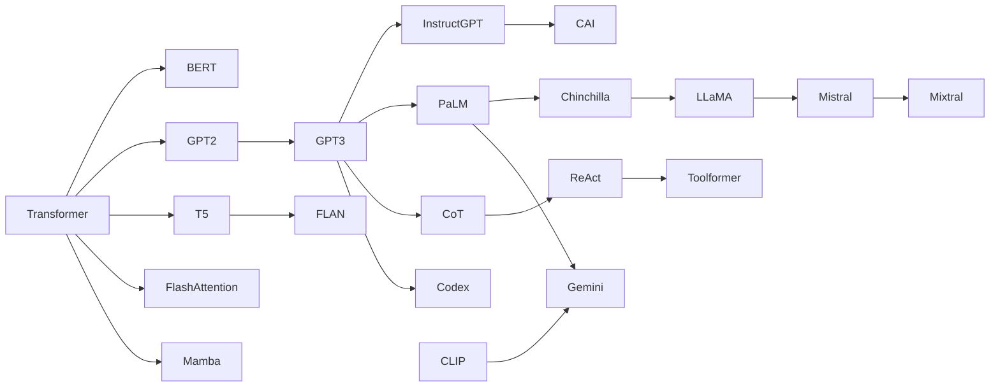

# Top 25 Research Papers in Large Language Models

This section provides **in-depth documentation** for the 25 landmark papers that shaped modern LLMs. Each paper page includes:

- **Simple math explanations** — every equation broken down step by step
- **Python implementations** — runnable code demonstrating the core ideas
- **Interview importance** — why interviewers ask about it and difficulty level
- **Interview Q&A** — specific questions with detailed answers
- **Connections** — how each paper relates to others

## How to Use This Section

1. **Quick review:** Read the TL;DR and Key Takeaways table at the bottom of each page
2. **Deep study:** Work through the math section and run the Python code
3. **Interview prep:** Focus on the Interview Q&A section — practice explaining these aloud
4. **Build connections:** Follow the "Connections to Other Papers" links to see how ideas evolved

## Papers by Category

### Architecture Foundations

| # | Paper | Year | Key Contribution |
|---|---|---|---|
| 1 | [Attention Is All You Need](01_attention_is_all_you_need.md) | 2017 | Transformer architecture — self-attention replaces recurrence |
| 2 | [BERT](02_bert.md) | 2018 | Bidirectional encoder with masked language modeling |
| 3 | [GPT-2](03_gpt2.md) | 2019 | Decoder-only LM with zero-shot task transfer |
| 5 | [T5](05_t5.md) | 2019 | Unified text-to-text framework with span corruption |
| 6 | [XLNet](06_xlnet.md) | 2019 | Permutation language modeling for bidirectional AR |

### Training Recipes & Scaling

| # | Paper | Year | Key Contribution |
|---|---|---|---|
| 4 | [GPT-3](04_gpt3.md) | 2020 | 175B params, in-context learning, scaling laws |
| 7 | [RoBERTa](07_roberta.md) | 2019 | Recipe matters — dynamic masking, no NSP, more data |
| 8 | [ELECTRA](08_electra.md) | 2020 | Replaced-token detection — 100% token utilization |
| 10 | [PaLM](10_palm.md) | 2022 | 540B dense model, Pathways infrastructure, emergence |
| 11 | [Chinchilla](11_chinchilla.md) | 2022 | Compute-optimal training — balance params and data |
| 12 | [LLaMA](12_llama.md) | 2023 | Open weights, RMSNorm + SwiGLU + RoPE standard |

### Alignment & Instruction Following

| # | Paper | Year | Key Contribution |
|---|---|---|---|
| 9 | [InstructGPT](09_instructgpt.md) | 2022 | RLHF pipeline — SFT → Reward Model → PPO |
| 17 | [FLAN](17_flan.md) | 2022 | Instruction tuning on 1,800+ tasks |
| 21 | [Constitutional AI](21_constitutional_ai.md) | 2022 | RLAIF — AI feedback guided by principles |

### Efficient Architecture & Serving

| # | Paper | Year | Key Contribution |
|---|---|---|---|
| 13 | [LoRA](13_lora.md) | 2021 | Low-rank adaptation — freeze base, train tiny updates |
| 14 | [FlashAttention](14_flash_attention.md) | 2022 | IO-aware exact attention — tiling in SRAM |
| 15 | [Mistral 7B](15_mistral.md) | 2023 | GQA + sliding window attention for efficient 7B |
| 16 | [Mixtral](16_mixtral.md) | 2024 | Sparse MoE — 8 experts, top-2 routing |
| 24 | [Mamba](24_mamba.md) | 2023 | Linear-time SSM with selective state spaces |

### Reasoning, Tools & Agents

| # | Paper | Year | Key Contribution |
|---|---|---|---|
| 18 | [Chain-of-Thought](18_chain_of_thought.md) | 2022 | Reasoning via intermediate steps in prompts |
| 19 | [ReAct](19_react.md) | 2023 | Thought → Action → Observation agent loop |
| 20 | [Toolformer](20_toolformer.md) | 2023 | Self-supervised API calling via loss comparison |

### Multimodal & Code

| # | Paper | Year | Key Contribution |
|---|---|---|---|
| 22 | [CLIP](22_clip.md) | 2021 | Contrastive image-text learning, zero-shot classification |
| 23 | [Codex](23_codex.md) | 2021 | Code generation, HumanEval benchmark, pass@k metric |
| 25 | [Gemini](25_gemini.md) | 2023 | Native multimodal — text, images, audio, video |

## Timeline

| Year | Papers |
|------|--------|
| 2017 | Transformer |
| 2018 | BERT |
| 2019 | GPT-2, XLNet, RoBERTa, T5 |
| 2020 | GPT-3, ELECTRA |
| 2021 | CLIP, Codex, LoRA |
| 2022 | InstructGPT, PaLM, Chinchilla, FlashAttention, FLAN, Chain-of-Thought, Constitutional AI |
| 2023 | LLaMA, Mistral 7B, ReAct, Toolformer, Mamba, Gemini |
| 2024 | Mixtral |

## Paper Interconnections

**Threads:**

- **Architecture:** Transformer → BERT/GPT/T5 → FlashAttention / Mistral / Mamba
- **Scaling:** GPT-3 → PaLM → Chinchilla → LLaMA
- **Alignment:** InstructGPT → Constitutional AI / FLAN
- **Tools & Agents:** Chain-of-Thought → ReAct → Toolformer
- **Multimodal:** CLIP → Gemini

## Interview Priority Guide

If you have limited time, focus on these papers first (highest interview frequency):

1. **Transformer** — asked in every LLM interview
2. **InstructGPT/RLHF** — mandatory for alignment questions
3. **LoRA** — essential for fine-tuning and serving questions
4. **FlashAttention** — key for systems/infrastructure roles
5. **LLaMA** — modern architecture standard (RMSNorm, SwiGLU, RoPE)
6. **Chinchilla** — scaling and training budget decisions
7. **Chain-of-Thought** — reasoning and prompt engineering
8. **BERT** — encoder vs. decoder understanding
9. **GPT-3** — in-context learning and scaling laws
10. **ReAct** — agent and tool-use systems
