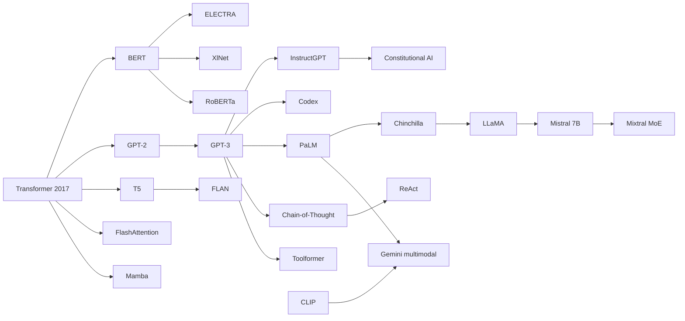

# Top 25 Research Papers in Large Language Models

This page is a **single reference** for landmark papers that shaped modern LLMs—from the Transformer through scaling laws, alignment, tools, and multimodal systems. Per paper: read **`abstract "TL;DR"`**, **Why It Matters**, the **`math-intuition`** equation, run the **code** sketch, then drill **`interview`** questions.

## How to Use This Section

Skim **TL;DR** first, connect **Why It Matters** to APIs and stacks you use, anchor on one **equation**, run the **code** (one idea per paper), rehearse **interview** prompts aloud.

## The Papers

### 1. Attention Is All You Need

**Ashish Vaswani, Noam Shazeer, Niki Parmar** (and 5 more). **2017.** *NeurIPS.*

!!! abstract "TL;DR"
    The paper replaces recurrence with **self-attention**: every token attends to every other token in one layer, weighted by learned compatibility. **Multi-head attention** runs several attention mechanisms in parallel so the model can capture different relational patterns (syntax, coreference, long-range agreement). **Positional encodings** inject order because attention itself is permutation-invariant. The result is a **encoder–decoder Transformer** that trains faster in parallel than RNNs and became the architectural backbone of virtually every large LM family.

**Why It Matters:** Decoder-only, encoder-only, and encoder–decoder stacks all inherit this blueprint. Serving systems (FlashAttention, KV cache, speculative decoding) optimize the same **attention** primitive—expect whiteboard explanations of \(O(n^2)\) cost and **weighted mixing** of values.

!!! math-intuition "In Plain English"
    Scaled dot-product attention maps queries \(Q\), keys \(K\), values \(V\) to an output:
    \[
    \mathrm{Attention}(Q,K,V) = \mathrm{softmax}\left(\frac{QK^\top}{\sqrt{d_k}}\right) V
    \]
    The softmax picks a **distribution over positions** to read from; multiplying by \(V\) forms a **convex combination** of value vectors. The scale \(\sqrt{d_k}\) keeps dot products from growing too large so softmax does not saturate.

```python
import numpy as np

def softmax_rows(x: np.ndarray) -> np.ndarray:
    e = np.exp(x - np.max(x, axis=-1, keepdims=True))
    return e / np.sum(e, axis=-1, keepdims=True)

def scaled_dot_product_attention(Q, K, V):
    d_k = Q.shape[-1]
    scores = (Q @ K.T) / np.sqrt(d_k)
    attn = softmax_rows(scores)
    return attn @ V  # convex mix of value rows
```

!!! interview "What Interviewers Expect"
    - Walk through **why** dot products measure “compatibility” between queries and keys, and what happens if you **omit** \(\sqrt{d_k}\).
    - Contrast **self-attention** in an encoder (full visibility) versus **masked** attention in a decoder (causal, no peeking at future tokens).
    - Name one **systems** consequence of materializing full attention: memory and FLOPs scaling with **sequence length squared**.


### 2. BERT: Pre-training of Deep Bidirectional Transformers for Language Understanding

**Jacob Devlin, Ming-Wei Chang, Kenton Lee** (and 1 more). **2018.** *NAACL.*

!!! abstract "TL;DR"
    BERT pre-trains deep **bidirectional** Transformer encoders using **Masked Language Modeling (MLM)**: randomly mask input tokens and predict them using *both* left and right context. A second objective, **Next Sentence Prediction (NSP)**, teaches rudimentary discourse between sentence pairs. Fine-tuning on labeled downstream tasks replaces only a thin task-specific head, yielding strong results on classification, NER, and QA-style benchmarks without architectural changes per task.

**Why It Matters:** BERT-style encoders still power **retrieval**, **rerankers**, and **classification** where bidirectional context wins. Interviews contrast **MLM** (full context for masked positions) with **causal** GPT pre-training (no future tokens).

!!! math-intuition "In Plain English"
    MLM maximizes the log-probability of masked tokens \(\mathcal{M}\) given the full corrupted input \(\tilde{\mathbf{x}}\):
    \[
    \mathcal{L}_{\text{MLM}} = - \mathbb{E}_{\mathbf{x}} \sum_{i \in \mathcal{M}} \log P_\theta(x_i \mid \tilde{\mathbf{x}})
    \]
    Only positions in \(\mathcal{M}\) contribute; the rest of the sequence acts as **context**—that is what makes the representation **bidirectional** at pre-training time.

```python
import numpy as np

def masked_ce_loss(logits, labels, mask_positions):
    # logits: [seq, vocab], labels: [seq], mask_positions: list of indices
    loss = 0.0
    for i in mask_positions:
        z = logits[i] - np.max(logits[i])
        p = np.exp(z) / np.sum(np.exp(z))
        loss -= np.log(p[labels[i]] + 1e-12)
    return loss / len(mask_positions)
```

!!! interview "What Interviewers Expect"
    - Explain **MLM** versus **causal** language modeling and trade-offs for **generation**.
    - Why was **NSP** later criticized, and what did RoBERTa change?
    - How would you use a BERT-style model in a **RAG** stack (retrieval vs reranking)?


### 3. Language Models are Unsupervised Multitask Learners (GPT-2)

**Alec Radford, Jeffrey Wu, Rewon Child** (and 3 more). **2019.** *Technical report (OpenAI).*

!!! abstract "TL;DR"
    GPT-2 shows that a **single** Transformer language model trained on WebText with a **byte-level BPE** vocabulary transfers to many tasks **without supervised fine-tuning**, via **conditional generation** (prompting). Performance scales with model size (117M–1.5B parameters in the release). The paper argues for **zero-shot task transfer** as evidence of emergent multitask behavior from language modeling alone—foreshadowing the “prompting era” that GPT-3 later amplified.

**Why It Matters:** It popularized **decoder-only** LMs, **BPE** vocabularies, and **prompting** over task-specific heads—still how chat models multiplex tasks. **Data**, **context length**, and **sampling** knobs remain production levers.

!!! math-intuition "In Plain English"
    Autoregressive modeling factorizes the joint as a **product of conditionals**:
    \[
    P_\theta(x_1,\ldots,x_n) = \prod_{i=1}^{n} P_\theta(x_i \mid x_{<i})
    \]
    Training minimizes **negative log-likelihood** over sequences. There is **no separate task head**—“tasks” are expressed by formatting context so the next-token distribution is useful.

```python
def autoregressive_nll(model_logprobs, tokens):
    # model_logprobs[i] = log P(token[i] | tokens[:i]) for i >= 1
    return -sum(model_logprobs[i] for i in range(1, len(tokens)))
```

!!! interview "What Interviewers Expect"
    - Define **zero-shot** versus **few-shot** in the GPT family; where does GPT-2 sit?
    - Why does **byte-level BPE** help with rare words and multiple languages?
    - Name a **failure mode** of relying on zero-shot transfer for production.


### 4. Language Models are Few-Shot Learners (GPT-3)

**Tom B. Brown, Benjamin Mann, Nick Ryder** (and 29 more). **2020.** *NeurIPS.*

!!! abstract "TL;DR"
    GPT-3 scales autoregressive Transformers to **175B parameters** and demonstrates **in-context learning**: at inference time, conditioning on a **prompt** with several input–output examples changes behavior without gradient updates. The paper maps **scaling laws**—performance improves predictably with model size, data, and compute—and shows breadth across benchmarks, while also documenting limitations (e.g., factual errors, biases, reasoning gaps).

**Why It Matters:** Reference for **few-shot prompting**, **API products**, and **scaling-law** debates; limits of prompting motivated **RLHF**, **tools**, and **RAG**. Interviewers probe **data mixture**, **contamination**, and **emergence** claims.

!!! math-intuition "In Plain English"
    In-context learning treats demonstration pairs \((x^{(k)}, y^{(k)})\) as part of the prefix \(c\); the model assigns:
    \[
    P_\theta(y \mid x, c) = \prod_{t} P_\theta(y_t \mid x, c, y_{<t})
    \]
    No explicit fine-tuning—**conditioning** implements an **implicit** task adaptation step.

```python
def few_shot_prompt(examples, query_x):
    parts = []
    for x, y in examples:
        parts.append(f"Q: {x}\nA: {y}\n")
    parts.append(f"Q: {query_x}\nA:")
    return "".join(parts)
```

!!! interview "What Interviewers Expect"
    - What is **in-context learning**, and why is it *not* the same as **gradient-based** fine-tuning?
    - Discuss **scaling laws** at a high level: what trades off against what?
    - How would you detect **benchmark leakage** or **memorization** when evaluating a GPT-3-class model?


### 5. Exploring the Limits of Transfer Learning with a Unified Text-to-Text Transformer (T5)

**Colin Raffel, Noam Shazeer, Adam Roberts** (and 4 more). **2019** (*JMLR* 2020).

!!! abstract "TL;DR"
    T5 casts **every NLP task** as **text-to-text**: inputs and targets are strings; the same encoder–decoder Transformer is trained with a denoising **span corruption** objective (randomly drop spans, predict missing pieces). This unification simplifies multi-task mixing and transfer: downstream tasks reuse the **same forward pass** with task prefixes like `"translate English to German:"`.

**Why It Matters:** **Text-to-text** shaped instruction templates and FLAN-style multitask SFT. Encoder–decoders remain relevant for **seq2seq**; **span corruption** differs from MLM and from GPT **causal LM**.

!!! math-intuition "In Plain English"
    Span corruption samples spans \(\mathbf{s}\) to delete from input \(\mathbf{x}\), producing \(\tilde{\mathbf{x}}\); the model predicts each missing token in order:
    \[
    \mathcal{L} = - \sum_{j} \log P_\theta(s_j \mid \tilde{\mathbf{x}}, \mathbf{s}_{<j})
    \]
    This is **denoising autoencoding** over contiguous spans—stronger than single-token MLM for learning to **copy and rewrite** spans.

```python
def span_corrupt(tokens, span_len=3, mask_token="<extra_id_0>"):
    i = max(1, len(tokens) // 2 - span_len // 2)
    corrupted = tokens[:i] + [mask_token] + tokens[i + span_len :]
    target = tokens[i : i + span_len]
    return corrupted, target
```

!!! interview "What Interviewers Expect"
    - Compare **encoder–decoder** versus **decoder-only** for translation and long-form generation.
    - How does **span corruption** differ from BERT MLM in terms of **supervision signal**?
    - Why might **task prefixes** help multitask training without separate model heads?


### 6. XLNet: Generalized Autoregressive Pretraining for Language Understanding

**Zhilin Yang, Zihang Dai, Yiming Yang** (and 3 more). **2019.** *NeurIPS.*

!!! abstract "TL;DR"
    XLNet combines ideas from **autoregressive modeling** and **bidirectional context** using **permutation language modeling (PLM)**: tokens are predicted in a random order, so each position can attend to **arbitrary subsets** of other positions according to the permutation. **Two-stream attention** separates **content** and **query** representations so the model cannot cheat by seeing the token being predicted. XLNet aimed to overcome BERT’s pretrain–finetune gap and MLM’s independence assumption.

**Why It Matters:** PLM clarifies **causal vs full-context** factorizations—useful context for **hybrid** and **diffusion** sequence models even though XLNet is not today’s default pretraining recipe.

!!! math-intuition "In Plain English"
    For permutation \(\pi\), the objective is an **ordered** product of conditionals consistent with \(\pi\):
    \[
    \mathcal{L}_{\text{PLM}} = \mathbb{E}_{\pi}\left[ \sum_{i} \log P_\theta\big(x_{\pi(i)} \mid \mathbf{x}_{\pi(<i)}\big) \right]
    \]
    Different permutations expose different **factorizations** of the same joint—this is how AR training accesses **richer context** than left-to-right only.

```python
import itertools

def plm_logprob_order(tokens, logp_fn, perm):
    total = 0.0
    for i, idx in enumerate(perm):
        ctx = [tokens[j] for j in perm[:i]]
        total += logp_fn(tokens[idx], ctx)
    return total
```

!!! interview "What Interviewers Expect"
    - Explain **permutation LM** versus standard left-to-right GPT training.
    - What problem does **two-stream attention** solve in XLNet?
    - Why did **RoBERTa + scale** often win engineering mindshare over XLNet in practice?


### 7. RoBERTa: A Robustly Optimized BERT Pretraining Approach

**Yinhan Liu, Myle Ott, Naman Goyal** (and 4 more). **2019.** *arXiv.*

!!! abstract "TL;DR"
    RoBERTa shows that **training recipe** matters as much as architecture: train BERT longer with **larger batches**, **more data**, **dynamic MLM masking** (re-sample masks each epoch), drop **NSP**, and use **byte-level BPE**. These changes yield substantial gains without adding parameters—emphasizing **optimization hygiene** (learning rate schedules, sequence length) in large-scale pre-training.

**Why It Matters:** RoBERTa showed **recipe** (dynamic MLM, longer training, more data, no NSP) beats architecture tweaks—fair comparisons must match **compute**, **data**, and **steps**.

!!! math-intuition "In Plain English"
    Dynamic MLM re-draws the mask set \(\mathcal{M}^{(t)}\) each epoch \(t\) over the same corpus:
    \[
    \mathcal{L}^{(t)} = - \sum_{i \in \mathcal{M}^{(t)}} \log P_\theta(x_i \mid \tilde{\mathbf{x}}^{(t)})
    \]
    Compared to a **static** mask, this exposes the model to **more supervision diversity** per token over training.

```python
import random

def dynamic_mlm_mask(ids, mask_prob=0.15, vocab_mask_token=103):
    out = ids.copy()
    mask_positions = [i for i in range(len(ids)) if random.random() < mask_prob]
    for i in mask_positions:
        out[i] = vocab_mask_token
    return out, mask_positions
```

!!! interview "What Interviewers Expect"
    - List **three** training changes in RoBERTa that improved BERT without new layers.
    - Why might **removing NSP** help or hurt—what was the empirical finding?
    - How do you **fairly compare** two pre-training runs at different batch sizes?


### 8. ELECTRA: Pre-training Text Encoders as Discriminators Rather Than Generators

**Kevin Clark, Minh-Thang Luong, Quoc V. Le, Christopher D. Manning.** **2020.** *ICLR.*

!!! abstract "TL;DR"
    ELECTRA trains a **small generator** to corrupt tokens and a **discriminator** to predict **which tokens were replaced**—binary classification per position. This is far more **sample-efficient** than predicting a full softmax over the vocabulary at every masked position (as in BERT). The discriminator encoder becomes a strong text representation model with lower compute per training step on large vocabularies.

**Why It Matters:** **Replaced-token detection** avoids full-vocab softmax at every position—cheaper encoder pretraining; connects to **discriminative** and contrastive pretraining. Useful when **domain-adapting** encoders for retrieval.

!!! math-intuition "In Plain English"
    Let \(G\) propose replacement \(\hat{x}_i\) for subset of positions; discriminator \(D\) outputs \(\sigma(s_i)\) for “real vs fake”:
    \[
    \mathcal{L}_{D} = - \sum_{i} \big[ y_i \log \sigma(s_i) + (1-y_i)\log(1-\sigma(s_i)) \big]
    \]
    where \(y_i = 1\) if token \(x_i\) was **not** replaced. This is **sigmoid cross-entropy**, not full-vocab softmax.

```python
import numpy as np

def sigmoid(x):
    return 1 / (1 + np.exp(-x))

def bce_discriminator_loss(scores, y):
    s = sigmoid(scores)
    return -np.mean(y * np.log(s + 1e-12) + (1 - y) * np.log(1 - s + 1e-12))
```

!!! interview "What Interviewers Expect"
    - Why is **replaced-token detection** more compute-efficient than MLM for large vocabs?
    - What role does the **small generator** play—could it be shared with the discriminator?
    - Compare ELECTRA-style objectives to **contrastive** learning (SimCSE, etc.).


### 9. Training Language Models to Follow Instructions with Human Feedback (InstructGPT)

**Long Ouyang, Jeff Wu, Xu Jiang** (and 15 more). **2022.** *NeurIPS.*

!!! abstract "TL;DR"
    The paper aligns GPT-3 with **human intent** using **supervised fine-tuning (SFT)** on demonstrations, then **reward modeling (RM)** from human rankings, then **PPO** to optimize policy against the reward while penalizing deviation from the reference model (**KL penalty**). The result is **InstructGPT**: better **helpfulness** and **truthfulness** on prompts humans care about, with smaller models sometimes beating larger base models on preference metrics.

**Why It Matters:** Canonical **SFT → RM → PPO** stack; interviews expect **KL penalty** rationale, **reward hacking**, and why base LMs optimize **LM loss**, not **user utility**. Extended today by **DPO** / **RLAIF**.

!!! math-intuition "In Plain English"
    RL objective with KL to reference \(\pi_{\text{ref}}\):
    \[
    \max_{\pi_\theta} \; \mathbb{E}_{x\sim \mathcal{D}, y\sim \pi_\theta(\cdot\mid x)} \big[ r_\phi(x,y) - \beta \log \frac{\pi_\theta(y\mid x)}{\pi_{\text{ref}}(y\mid x)} \big]
    \]
    The KL term stops the policy from collapsing to **high-reward but degenerate** outputs that fool \(r_\phi\).

```python
def kl_penalty(logp_new, logp_ref):
    # per-token approximate; production code uses full sequences
    return (logp_new - logp_ref).sum()

def ppo_style_objective(r, adv, ratio, clip=0.2):
    # ratio = exp(logp_new - logp_old)
    unclipped = ratio * adv
    clipped = np.clip(ratio, 1 - clip, 1 + clip) * adv
    return -np.mean(np.minimum(unclipped, clipped))
```

!!! interview "What Interviewers Expect"
    - Draw the **three-stage** pipeline and name failure modes at each stage.
    - Why include a **KL penalty**—what goes wrong without it?
    - Compare **RLHF** to **DPO** at a high level (what each optimizes).


### 10. PaLM: Scaling Language Modeling with Pathways

**Aakanksha Chowdhery, Sharan Narang, Jacob Devlin** (and 60+ more). **2022.** *arXiv / JMLR.*

!!! abstract "TL;DR"
    PaLM trains a **540B** dense Transformer on a large multilingual corpus using **Pathways** infrastructure for **efficient data- and model-parallel** training across TPU pods. The paper documents **emergent** capabilities (reasoning chains, code, translation) that appear abruptly at scale, alongside systematic evaluations (**BIG-Bench**). It reinforces **scaling** as the primary lever for capability jumps when recipes are held stable.

**Why It Matters:** Highlights **data**, **multilingual**, **Pathways-scale** infra, and **BIG-Bench**-style evals—systems interviews pair with **tensor/pipeline parallelism** and **emergence** debates.

!!! math-intuition "In Plain English"
    Training minimizes **cross-entropy** over tokens with model parameters \(\theta\) at large batch \(B\) and sequence length \(L\):
    \[
    \mathcal{L}(\theta) = - \frac{1}{|\mathcal{B}|} \sum_{(x)\in\mathcal{B}} \sum_{t=1}^{L} \log P_\theta(x_t \mid x_{<t})
    \]
    At PaLM scale, **throughput** \(=\) tokens/sec processed determines wall-clock; **parallelism strategies** change the constant factors in front of the same loss.

```python
# Toy: data-parallel shard of batch (conceptual)
def shard_batch(batch_x, num_shards):
    chunk = len(batch_x) // num_shards
    return [batch_x[i * chunk : (i + 1) * chunk] for i in range(num_shards)]
```

!!! interview "What Interviewers Expect"
    - Name **two** distributed parallelism patterns (data, tensor, pipeline) and when each applies.
    - What does **emergence** mean in scaling papers—why is it controversial?
    - How would you **evaluate** a multilingual LM beyond English-centric benchmarks?


### 11. Training Compute-Optimal Large Language Models (Chinchilla)

**Jordan Hoffmann, Sebastian Borgeaud, Arthur Mensch** (and 8 more). **2022.** *arXiv.*

!!! abstract "TL;DR"
    Chinchilla revisits scaling laws and argues many models were **undertrained**: for a fixed **FLOPs** budget, **smaller models trained on more data** often outperform larger models trained on less data. The work fits **empirical laws** relating loss to parameters \(N\) and tokens \(D\), and derives **compute-optimal** trade-offs—guiding how to spend a training budget.

**Why It Matters:** Fixed compute favors **smaller models + more tokens**—shaped open-model training (e.g. LLaMA). Interviewers ask **Chinchilla-optimal** tradeoffs vs **data-limited** regimes.

!!! math-intuition "In Plain English"
    A simplified scaling hypothesis:
    \[
    L(N,D) \approx A/N^{\alpha} + B/D^{\beta} + L_\infty
    \]
    Loss falls with **more parameters** and **more tokens**, with **diminishing returns**. For fixed compute \(C \propto ND\), the optimum shifts toward **balancing** \(N\) and \(D\) rather than maxing \(N\) alone.

```python
def approx_loss(N, D, A=0.5, B=0.5, a=0.34, b=0.28, L_inf=1.2):
    return A / (N ** a) + B / (D ** b) + L_inf

def flops_budget(N, D, F_per_token=6e18 / 1e24):  # toy coefficient
    return F_per_token * N * D
```

!!! interview "What Interviewers Expect"
    - State the **Chinchilla insight** in one sentence about \(N\) versus \(D\).
    - What assumptions break scaling laws (e.g., **data saturation**, **repeated epochs**)?
    - How would you decide whether to **increase data** versus **model width** under a fixed budget?


### 12. LLaMA: Open and Efficient Foundation Language Models

**Hugo Touvron, Thibaut Lavril, Gautier Izacard** (and 4 more). **2023.** *arXiv.*

!!! abstract "TL;DR"
    LLaMA trains **openly released** foundation models using **Chinchilla-style** token budgets: more training tokens relative to size (7B–65B). Architecture tweaks include **pre-normalization (RMSNorm)**, **SwiGLU** activations, **rotary positional embeddings (RoPE)**, and efficient attention implementations. The goal is **strong performance per parameter** to enable research and local deployment.

**Why It Matters:** Open-weights baseline (Alpaca, Vicuna, Llama 2/3); **7B/13B/70B** choices trade **VRAM**, **tokens seen**, and **license**. RMSNorm, SwiGLU, RoPE appear on model cards everywhere.

!!! math-intuition "In Plain English"
    **RMSNorm** scales activations \(\mathbf{x}\) without mean-centering:
    \[
    \bar{\mathbf{x}} = \frac{\mathbf{x}}{\sqrt{\frac{1}{d}\|\mathbf{x}\|^2 + \epsilon}} \odot \boldsymbol{\gamma}
    \]
    Compared to LayerNorm, it removes the **mean** term for speed/simplicity while stabilizing scale.

```python
import numpy as np

def rmsnorm(x, gamma, eps=1e-6):
    rms = np.sqrt(np.mean(x ** 2) + eps)
    return (x / rms) * gamma
```

!!! interview "What Interviewers Expect"
    - Name **three** architectural choices in LLaMA versus original GPT-2/3 stacks.
    - Connect LLaMA training to **Chinchilla-optimal** thinking.
    - What **deployment** constraints push teams toward 7B/13B rather than 70B?


### 13. LoRA: Low-Rank Adaptation of Large Language Models

**Edward J. Hu, Yelong Shen, Phillip Wallis** (and 3 more). **2021.** *ICLR.*

!!! abstract "TL;DR"
    LoRA freezes pretrained weights \(W_0\) and injects trainable **low-rank** updates \(\Delta W = B A\) for linear layers, where \(B \in \mathbb{R}^{d\times r}\), \(A \in \mathbb{R}^{r\times k}\), \(r \ll \min(d,k)\). During inference, \(\Delta W\) can be **merged** into \(W\) so there is no latency penalty. This enables **cheap specialization** (domains, tasks, users) without full fine-tunes.

**Why It Matters:** Default **PEFT** path (adapters, **QLoRA**, per-tenant heads). Interviews probe **rank \(r\)**, **target modules**, and **merging** for deployment.

!!! math-intuition "In Plain English"
    Forward pass for a frozen linear map with LoRA:
    \[
    h = W_0 x + \Delta W x = W_0 x + B A x
    \]
    Trainable parameters are **\(r(d+k)\)** instead of **\(dk\)** when \(r\) is small—quadratic savings in width.

```python
import numpy as np

def lora_linear(x, W0, A, B):
    # x: [k], W0: [d, k], A: [r, k], B: [d, r]
    return W0 @ x + B @ (A @ x)
```

!!! interview "What Interviewers Expect"
    - Why does low-rank structure make sense for **task-specific** updates?
    - Where would you **not** use LoRA (e.g., full-model **continued pretraining**)?
    - How does **merging adapters** into base weights affect **serving**?


### 14. FlashAttention: Fast and Memory-Efficient Exact Attention with IO-Awareness

**Tri Dao, Daniel Y. Fu, Stefano Ermon, Atri Rudra, Christopher Ré.** **2022.** *NeurIPS.*

!!! abstract "TL;DR"
    FlashAttention computes **exact** attention while **avoiding materializing** the full \(N\times N\) attention matrix in GPU HBM by **tiling** and **fusing** softmax with matrix multiplies in SRAM. IO-aware scheduling reduces memory reads/writes, yielding **faster** training and **longer** sequences for the same memory budget—without approximating attention scores.

**Why It Matters:** Default in **PyTorch 2** / **vLLM**; interviewers separate **HBM bandwidth** from **FLOPs** when explaining long-context costs.

!!! math-intuition "In Plain English"
    Attention still computes:
    \[
    S = QK^\top/\sqrt{d},\quad P = \mathrm{softmax}(S),\quad O = PV
    \]
    FlashAttention **reorders blocks** so partial softmax statistics can be **composed** without storing full \(S\)—exact output \(O\), lower **HBM traffic**.

```python
# Conceptual: softmax is stable via max-subtraction per row
def softmax_stable(x):
    x = x - np.max(x, axis=-1, keepdims=True)
    e = np.exp(x)
    return e / np.sum(e, axis=-1, keepdims=True)
```

!!! interview "What Interviewers Expect"
    - Why is attention often **memory-bound**, not compute-bound, on GPUs?
    - What does **exact** mean versus **sparse** or **linear** attention approximations?
    - How does FlashAttention interact with **long context** and **batch size** in serving?


### 15. Mistral 7B

**Albert Q. Jiang, Alexandre Sablayrolles, Arthur Mensch** (and 5 more). **2023.** *arXiv.*

!!! abstract "TL;DR"
    Mistral 7B demonstrates that a **carefully trained** 7B model with **Sliding Window Attention (SWA)** and **grouped-query attention (GQA)** can match or beat much larger models on many benchmarks—emphasizing **efficient architecture** and **data/curriculum** over raw parameter count. The release strengthened the **small-but-mighty** open-weights narrative for local deployment.

**Why It Matters:** **GQA** + **SWA** = strong **7B** open weights; informs **routers** (7B vs MoE vs 70B) and **KV** footprint.

!!! math-intuition "In Plain English"
    **Sliding window** restricts attention so token \(i\) only attends to \(i-W,\ldots,i\):
    \[
    A_{ij} = 0 \quad \text{if } j < i-W \text{ or } j > i
    \]
    Complexity approaches **\(O(nW)\)** instead of **\(O(n^2)\)** for long \(n\) when implemented with locality.

```python
def sliding_window_mask(seq_len, W):
    m = [[0.0] * seq_len for _ in range(seq_len)]
    for i in range(seq_len):
        for j in range(max(0, i - W), i + 1):
            m[i][j] = 1.0
    return m
```

!!! interview "What Interviewers Expect"
    - Compare **GQA** to **MHA** and **MQA**—what is saved at inference?
    - What is the **throughput–quality** trade-off of sliding-window attention?
    - When would you still prefer a **70B dense** over a **strong 7B**?


### 16. Mixtral of Experts

**Albert Q. Jiang, Alexandre Sablayrolles, Antoine Roux** (and 5 more). **2024.** *arXiv.*

!!! abstract "TL;DR"
    Mixtral is a **sparse Mixture-of-Experts (MoE)** Transformer: each layer has multiple **feed-forward experts**, and a **router** selects **top-\(k\)** experts per token. Only selected experts run, so **active** parameters per token stay manageable while **total** capacity grows. The open-weight Mixtral models compete with larger dense models on efficiency-adjusted metrics.

**Why It Matters:** **Sparse MoE** adds expert **capacity** without linear **active FLOPs**; interviews hit **routing**, **load balance**, **expert collapse**, and **all-to-all** in serving.

!!! math-intuition "In Plain English"
    MoE output combines expert functions \(E_i\) with gating weights \(g_i(x)\):
    \[
    h_{\text{out}} = \sum_{i \in \text{Top-}k} g_i(x)\, E_i(h_{\text{in}})
    \]
    Sparsity means **most** \(g_i\) are zero—only a **subset** of experts executes.

```python
import numpy as np

def topk_moe(h, experts, router_logits, k=2):
    scores = softmax(router_logits)  # toy
    idx = np.argsort(-scores)[:k]
    out = np.zeros_like(h)
    for i in idx:
        out += scores[i] * experts[i](h)
    return out

def softmax(z):
    e = np.exp(z - np.max(z))
    return e / e.sum()
```

!!! interview "What Interviewers Expect"
    - What **hardware** issues arise when different tokens route to different experts?
    - How do training objectives mitigate **expert imbalance**?
    - Compare **MoE** to **dense** models at the same **active** FLOPs.


### 17. Scaling Instruction-Finetuned Language Models (FLAN)

**Hyung Won Chung, Le Hou, Shayne Longpre** (and 10 more). **2022.** *arXiv.*

!!! abstract "TL;DR"
    FLAN **instruction fine-tunes** a pretrained LM on a large mixture of **tasks phrased as instructions**, improving **zero-shot** generalization to unseen tasks described at inference time. Scaling **tasks**, **model size**, and **chain-of-thought** data together yields **FLAN-T5/PaLM** variants that perform strongly on held-out task clusters—supporting **multitask prompting** transfer.

**Why It Matters:** **Instruction mix** + phrasing as **data engineering**—precursor to chat models and **IFEval**-style tests; contrast with **RLHF** (SFT vs preferences).

!!! math-intuition "In Plain English"
    Instruction tuning minimizes **supervised** loss over instruction–response pairs \((u, y)\):
    \[
    \mathcal{L}_{\text{SFT}} = - \sum_{t} \log P_\theta(y_t \mid u, y_{<t})
    \]
    Same objective as LM training, but on **curated** multitask conversational data—**distribution shift** toward user-like prompts.

```python
def instruction_prompt(task_name, x):
    return f"Task: {task_name}\nInput: {x}\nOutput:"
```

!!! interview "What Interviewers Expect"
    - How does **instruction tuning** differ from **pretraining** in data and objective?
    - Why include **CoT** demonstrations in some FLAN variants?
    - What limits **zero-shot** transfer to truly **novel** tasks?


### 18. Chain-of-Thought Prompting Elicits Reasoning in Large Language Models

**Jason Wei, Xuezhi Wang, Dale Schuurmans** (and 5 more). **2022.** *NeurIPS.*

!!! abstract "TL;DR"
    **Chain-of-thought (CoT)** prompting appends **intermediate reasoning steps** before the final answer—either via **few-shot exemplars** with rationales or **zero-shot** triggers (“Let’s think step by step”). Large models show large gains on **math**, **commonsense**, and **symbolic** tasks where single-step answers fail. The effect is **emergent** with scale for some models/tasks.

**Why It Matters:** Default for **reasoning** prompts and **self-consistency**; costs **tokens** and can **hallucinate steps**—interviews pair with **verifiers** and **RL** on traces.

!!! math-intuition "In Plain English"
    CoT models a **latent rationale** \(z\) before answer \(a\):
    \[
    P_\theta(a, z \mid x) = P_\theta(z \mid x)\, P_\theta(a \mid x, z)
    \]
    Marginalizing \(z\) is intractable; **sampling** one or many chains approximates reasoning paths.

```python
def cot_prompt(question):
    return f"Q: {question}\nA: Let's think step by step.\n"
```

!!! interview "What Interviewers Expect"
    - When does CoT **hurt** (verbosity, hallucinated steps)?
    - Explain **self-consistency** decoding at a high level.
    - How would you **evaluate** reasoning besides final-answer accuracy?


### 19. ReAct: Synergizing Reasoning and Acting in Language Models

**Shunyu Yao, Jeffrey Zhao, Dian Yu** (and 5 more). **2023.** *ICLR.*

!!! abstract "TL;DR"
    ReAct interleaves **natural language reasoning** traces with **structured actions** (e.g., search, lookup) in a loop: **Thought → Action → Observation**. This pattern beats **reasoning-only** or **acting-only** baselines on tasks requiring **grounding** in external information. It frames LLM agents as **policies** over tool APIs with **observable feedback**.

**Why It Matters:** **Thought / Action / Observation** loop underpins agent frameworks; interviews cover **tool schemas**, **max steps**, and **stop** conditions.

!!! math-intuition "In Plain English"
    A trajectory \(\tau = (t_1,a_1,o_1,\ldots)\) is generated by alternating:
    \[
    t_k \sim P_\theta(\cdot \mid x, \tau_{<k}),\quad a_k \sim \pi_\theta(\cdot \mid x, \tau_{<k}, t_k)
    \]
    Observations \(o_k = \mathrm{Env}(a_k)\) **condition** subsequent thoughts—**closed-loop** behavior.

```python
def react_loop(model_step, env, query, max_steps=5):
    traj = f"Task: {query}\n"
    for _ in range(max_steps):
        traj += model_step(traj)  # append Thought + Action
        if "Action: STOP" in traj:
            break
        obs = env.last_observation()
        traj += f"Observation: {obs}\n"
    return traj
```

!!! interview "What Interviewers Expect"
    - How do you **prevent** infinite tool loops?
    - What’s the difference between ReAct and **plain CoT** without tools?
    - How does **observation trustworthiness** affect policy design?


### 20. Toolformer: Language Models Can Teach Themselves to Use Tools

**Timo Schick, Jane Dwivedi-Yu, Roberto Dessì** (and 4 more). **2023.** *arXiv.*

!!! abstract "TL;DR"
    Toolformer **supervises** a LM to **call APIs** (calculator, retrieval, translation) by predicting special **API tokens**; training data is **augmented** with sampled calls and **filtered** by whether the API output **reduces** LM loss on future tokens. The result is **selective** tool use without RL—**self-supervised** curriculum from the model’s own generations.

**Why It Matters:** Early **learned tool use** without RL; aligns with **function-calling** APIs—**latency**, **safety**, and **when to call** vs **retrieve**.

!!! math-intuition "In Plain English"
    Filtering compares **counterfactual** losses with and without tool output \(o\):
    \[
    \Delta \mathcal{L} = \mathcal{L}_{\text{LM}}(x \mid \text{no tool}) - \mathcal{L}_{\text{LM}}(x \mid o)
    \]
    Keep calls where \(\Delta \mathcal{L} > 0\)—the tool **helps** predict ground-truth text.

```python
def accept_call(loss_without, loss_with):
    return loss_without - loss_with > 0  # empirical threshold in paper
```

!!! interview "What Interviewers Expect"
    - How does Toolformer **discover** useful calls without hand-labeled tool traces?
    - What **risks** arise from letting models invoke external APIs?
    - Compare Toolformer to **ReAct-style** prompt engineering with a frozen model.


### 21. Constitutional AI: Harmlessness from AI Feedback

**Yuntao Bai, Saurav Kadavath, Sandipan Kundu** (and 15 more). **2022.** *arXiv.*

!!! abstract "TL;DR"
    Constitutional AI (**CAI**) trains models using **principles** (“constitution”) to critique and revise responses, enabling **scalable supervision** without as much human labeling. The pipeline combines **supervised learning** from revised outputs and **RL from AI feedback (RLAIF)**—preference models trained on model-generated comparisons guided by principles. Harmlessness improves with **reduced human oversight** cost versus pure RLHF.

**Why It Matters:** **Principles → critique → revision → RLAIF** scales alignment without all-human prefs; debates: **over-refusal**, **whose rules**, vs **RLHF**.

!!! math-intuition "In Plain English"
    Preference learning maximizes likelihood of **chosen** \(y_w\) over **rejected** \(y_l\) under implicit reward \(r\):
    \[
    P(y_w \succ y_l \mid x) = \sigma\big(r(x,y_w) - r(x,y_l)\big)
    \]
    CAI generates \((y_w,y_l)\) pairs via **principle-guided** critiques—**AI-labeled** preferences.

```python
import numpy as np

def bradley_terry_logit(rw, rl):
    return 1 / (1 + np.exp(-(rw - rl)))
```

!!! interview "What Interviewers Expect"
    - Compare **RLHF**, **RLAIF**, and **constitutional** critique steps.
    - What failure modes appear from **AI-only** feedback (circular preferences)?
    - How would you **audit** a constitution for **bias** or **over-blocking**?


### 22. Learning Transferable Visual Models From Natural Language Supervision (CLIP)

**Alec Radford, Jong Wook Kim, Chris Hallacy** (and 9 more). **2021.** *ICML.*

!!! abstract "TL;DR"
    CLIP trains **dual encoders**—image and text Transformers—on **400M (image, text)** pairs from the web using **contrastive learning** to match paired embeddings and repel non-pairs. The resulting **image encoder** zero-shot classifies via **natural-language prompts** (“a photo of a …”) without task-specific heads—strong **robustness** and **representation transfer**.

**Why It Matters:** **Dual encoders + InfoNCE** power VLM **retrieval**, **diffusion** conditioning, and **image RAG**—baseline multimodal **alignment** story.

!!! math-intuition "In Plain English"
    With normalized embeddings \(g_i = f_I(x_i)/\|f_I(x_i)\|\), \(t_i = f_T(y_i)/\|f_T(y_i)\|\), **InfoNCE** for batch size \(B\):
    \[
    \mathcal{L}_i = - \log \frac{\exp(g_i^\top t_i / \tau)}{\sum_{j=1}^{B} \exp(g_i^\top t_j / \tau)}
    \]
    Denominator includes **in-batch negatives**—cheap contrastive supervision.

```python
import numpy as np

def clip_infonce(g, t, tau=0.07):
    g = g / np.linalg.norm(g, axis=1, keepdims=True)
    t = t / np.linalg.norm(t, axis=1, keepdims=True)
    logits = (g @ t.T) / tau
    labels = np.arange(len(g))
    # symmetric CE omitted for brevity
    return -np.mean(np.log(np.exp(np.diag(logits)) / np.sum(np.exp(logits), axis=1)))
```

!!! interview "What Interviewers Expect"
    - Why do **in-batch negatives** work, and what breaks at **small batch**?
    - How does CLIP enable **zero-shot** classification via prompts?
    - Name **failure modes** (texture bias, OCR gaps, domain shift).


### 23. Evaluating Large Language Models Trained on Code (Codex)

**Mark Chen, Jerry Tworek, Heewoo Jun** (and 20 more). **2021.** *arXiv.*

!!! abstract "TL;DR"
    Codex fine-tunes GPT models on **GitHub code**, producing systems that **complete code** from docstrings and comments (Copilot lineage). The paper introduces **HumanEval**: **164 hand-written** Python tasks with **functional unit tests**—now a standard for **pass@\(k\)** evaluation. It documents **limitations** (imports, long context) and **safety** considerations for code LM deployment.

**Why It Matters:** **HumanEval** / **pass@\(k\)** defined code LM evals; Copilot-style tools add **FIM**, **repo context**, **static checks**.

!!! math-intuition "In Plain English"
    **pass@\(k\)**: probability that **at least one** of \(k\) independent samples passes **all** tests:
    \[
    \mathrm{pass@}k = \mathbb{E}_{\text{tasks}}\left[1 - \frac{\binom{n-c}{k}}{\binom{n}{k}}\right]
    \]
    where \(n\) is samples per task, \(c\) is correct—accounts for **finite-sample** estimation without replacement.

```python
from math import comb

def pass_at_k(n, c, k):
    if n - c < k:
        return 1.0
    return 1.0 - comb(n - c, k) / comb(n, k)
```

!!! interview "What Interviewers Expect"
    - Why is **HumanEval** limited, and what complements it (MBPP, SWE-bench)?
    - Explain **pass@\(k\)** versus **pass@1** for temperature-sampled models.
    - What **security** issues arise from training on public GitHub?


### 24. Mamba: Linear-Time Sequence Modeling with Selective State Spaces

**Albert Gu, Tri Dao.** **2023.** *arXiv.*

!!! abstract "TL;DR"
    Mamba advances **structured state-space models (SSMs)** for sequences with **input-dependent** (selective) parameters, letting the model **filter information** along the sequence like **gated RNNs** but with **parallel training** via **associative scan**. It achieves **linear time** in sequence length for the recurrent core and competes with Transformers on **throughput** and **long-sequence** modeling in benchmarks.

**Why It Matters:** **Selective SSMs** offer **linear-time** sequence cores vs \(O(n^2)\) attention—**edge**, **streaming**, **hybrid** (SSM + attention) tradeoffs.

!!! math-intuition "In Plain English"
    A discrete SSM maps input \(x_t\) to state \(h_t\):
    \[
    h_t = \bar{A}_t h_{t-1} + \bar{B}_t x_t,\quad y_t = C_t h_t
    \]
    **Selectivity** means \(\bar{A}_t,\bar{B}_t,C_t\) depend on \(x_t\)—the model **chooses** what to remember **per timestep**.

```python
def ssm_step(h, x, Abar, Bbar, C):
    h = Abar * h + Bbar * x
    y = C * h
    return h, y
```

!!! interview "What Interviewers Expect"
    - Contrast **Mamba/SSM** complexity versus **self-attention** versus **RNNs**.
    - What does **selectivity** buy you that fixed S4 parameters lack?
    - Where might you still want **attention** (e.g., **global** retrieval)?


### 25. Gemini: A Family of Highly Capable Multimodal Models

**Gemini Team, Google.** **2023.** *arXiv / technical report.*

!!! abstract "TL;DR"
    Gemini trains **multimodal** models **natively** over **text, images, audio, and video** interleaved in context—**from the ground up**, not only via frozen vision encoders bolted to text decoders. The report emphasizes **benchmark-leading** results across reasoning, code, and multimodal understanding, **tool use**, and **long context** (later variants push windows further). It reflects **Google DeepMind**-scale **data**, **infrastructure**, and **eval harnesses**.

**Why It Matters:** **Native multimodal** (interleaved tokens) vs **stitched** vision encoder + LM; product + **safety** per modality; ties **CLIP**, **PaLM**, **alignment** threads.

!!! math-intuition "In Plain English"
    A generic **multimodal** LM models token sequence \(z\) (text tokens, image/audio patches as tokens):
    \[
    P_\theta(z) = \prod_{t} P_\theta(z_t \mid z_{<t})
    \]
    **Same autoregressive objective**—modality is **flattened** into a **unified token stream** with **modality-specific embeddings**.

```python
def interleave_tokens(text_toks, image_toks):
    # conceptual: [IMG]*n then text, or interleaved per layout
    return image_toks + text_toks
```

!!! interview "What Interviewers Expect"
    - Compare **native multimodal pretraining** to **frozen encoder + LLM** stacks.
    - What **eval** challenges are unique to **video** or **audio** versus images?
    - How would you design **red-teaming** for a multimodal product?

## Timeline

| Year | Papers |
|------|--------|
| 2017 | Transformer |
| 2018 | BERT |
| 2019 | GPT-2, XLNet, RoBERTa |
| 2020 | GPT-3, T5, ELECTRA |
| 2021 | CLIP, Codex, LoRA |
| 2022 | InstructGPT, PaLM, Chinchilla, FlashAttention, FLAN, CoT, Constitutional AI |
| 2023 | LLaMA, Mistral 7B, ReAct, Toolformer, Mamba, Gemini |
| 2024 | Mixtral |

## Paper Interconnections

Directed edges read as **“influences / builds on / operationalizes”**—informal, for study purposes.



**Threads:** architecture (Transformer \(\rightarrow\) BERT/GPT/T5 \(\rightarrow\) FlashAttention / Mistral / Mamba); scaling (GPT-3 \(\rightarrow\) PaLM \(\rightarrow\) Chinchilla \(\rightarrow\) LLaMA); alignment (InstructGPT \(\rightarrow\) CAI / FLAN); tools (CoT \(\rightarrow\) ReAct \(\rightarrow\) Toolformer); multimodal (CLIP \(\rightarrow\) Gemini).

*Pair with LLMBase architecture and training chapters in the site navigation for depth.*
